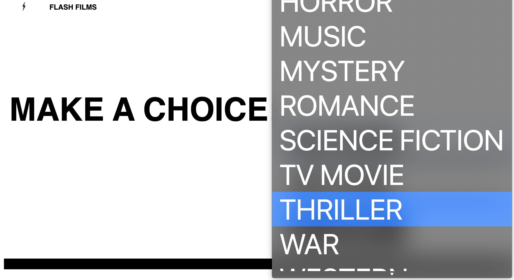
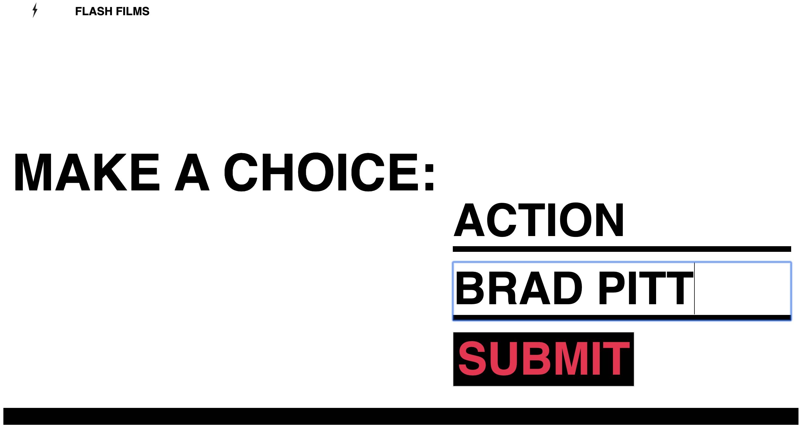
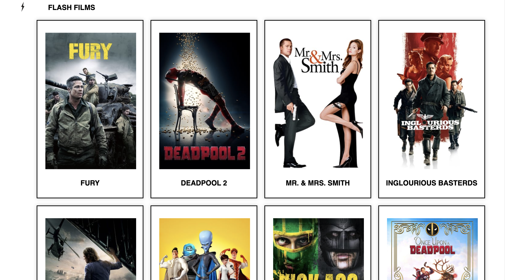
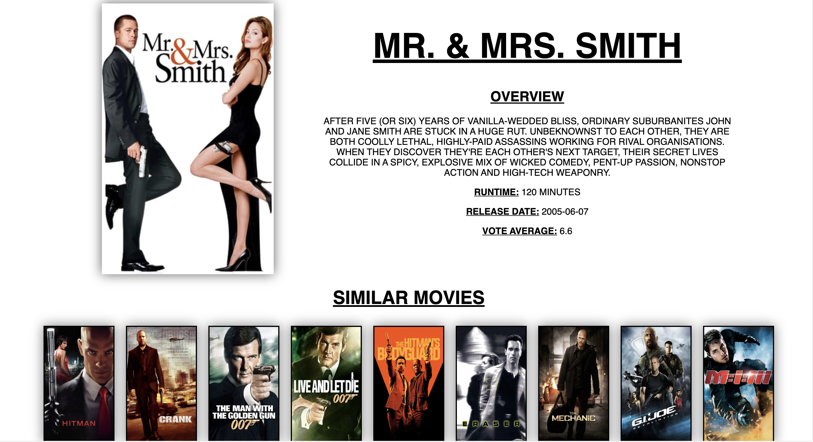

# FLASH FILMS 

#  Project #2: 48hr Reactathon


# Brief
For our second project at GA ‘React Hakathon’, we were expected to build a React.js app using a 3rd party API, which was to be pair coded in 48 hours.

Timeframe: 48 hrs.

# Deployment
Check out FLASHFILMS here https://flashfilms.herokuapp.com/


# Motivation
As a pair we wanted to build a website that was either based on our mutual interests or something that was at least useful/that we might use in the future.

Our end product was Flash Films, a platform where users can search and filter different movies from an external API, the MovieDB.

# Approach
Our first step, and undoubtedly the hardest, was to decide on the public API we wanted to consume. We came up with several different ideas and found it extremely difficult to settle on which public API we wanted to use. At one point we wanted to use 3 different public APIs. However, then we realised we had to be realistic given the timeframe in which we were working with and decided to use the MovieDB, partly down to its clear/easy to understand documentation.

Once this was agreed upon, we laid out our basic MVP. We kept it very simple giving us the time to get rid of any bugs and add any additional features.

This was my first time pair programming and I really enjoyed working alongside someone else in a team. We both had different strongpoints and learnt a huge amount off each other in such a small window/space of time. On top of this, the communication between myself and my team mate was very good and this made the process enjoyable. We were organised and had a detailed plan of execution and set ourselves daily goals. 

# Features
 - Homepage
 - Filter search by Genre and or Actor 
 - Index page with all the results of the search
 - Show pages of each individual film with a short bio and a list of similar movies
 - Navigate through different pages using react router


# Screenshots
After the homepage flashes you with the name 'Flash Films' you come to the search page where you can search by genre, actor or both.





Here is an example of searching for a thriller film with Brad Pitt in it.



The results are as follows:



And here once you have clicked on one of the search results, you come to the showpage of that movie where you can find out more information on that film as well as similar movies.




Technologies and Frameworks used:

 - React.js
 - axios (for API requests)
 - Insomnia
 - HTML5
 - CSS 3
 - JavaScript (ES6)
 - Git/Github
 - Babel
 - Google Fonts
 - SASS
 - Animate.css

# Challenges
As previously mentioned, the most difficult part of this project was the beginning, deciding what API we wanted to use. We had so many different ideas between us and narrowing down our ideas proved to be one of the most time-consuming, challenging tasks. 

We looked at Spotify, Deezer, Eventbrite, Cine List, Skyscanner and Mapbox. Some of these we had to wait for a response from the internal dev teams and others weren’t very easy to understand (documentation). This helped us to settle on the MovieDB API.

# Wins
We successfully created error handlers. We decided to set searchResult to false in our state. If no results came back from our API call searchResult would remain false in state. We wrote this error handler after render to inform the user that there were no results for their search.

```
render() {
    console.log(this.state)
    if (this.state.searchResult) {
      return (
        <div className="error-response animated fadeInRight">
          <h1>OOPS! There were no results for your search...</h1>
        </div>
      )
    }
```

Similarly, if the user clicks on search without having selected a genre or actor, they are told they have performed an invalid search.
```
      axios.get(`https://api.themoviedb.org/3/search/person?include_adult=false&query=${formattedActorName}&&page=1&language=en-US&api_key=${process.env.MOVIEDB_ACCESS_TOKEN}`)
        .then(res => {
          if (res.data.results.length === 0) {

            this.setState({ error: true, searchActor: 'Invalid search' })
            setTimeout(() => {

              return this.setState({ error: false })
            },3000)
            return
          }
```


# Future Features
With more time, these are the additional features I would like to add:
 - Adding more functionality for filtered searches e.g. 
    - By director
    - By decade
    - By mood, with a mood board
 - A randomiser button that would return a random movie
 - A toggle that would change the search results from movies to TV shows as well as inverse the styling theme to be a black background with white writing rather than the other way round.


